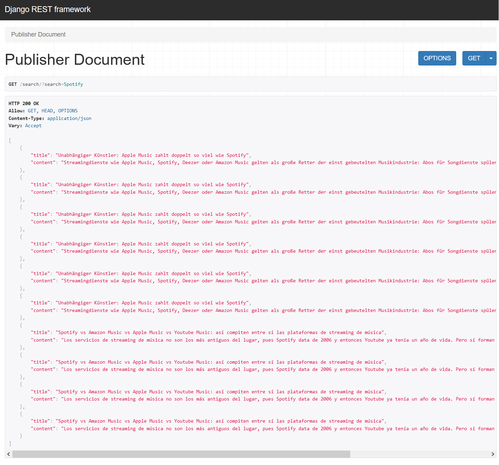

## Django and Elasticsearch

1. Install and run Elasticsearch on you station
2. Create virtual env
3. create .env file and add API Key
4. pip install -r requirements.txt
5. ./manage.py migrate
6. ./manage.py createsuperuser
7. ./manage.py search_index --rebuild
8. ./manage.py runsever

Populating news from newsapi.org on localhost:8000. Log for locahost:8000/admin for checking news

And finally you can get information on JSON e.g. for Spotify: http://localhost:8000/search/?search=Spotify

